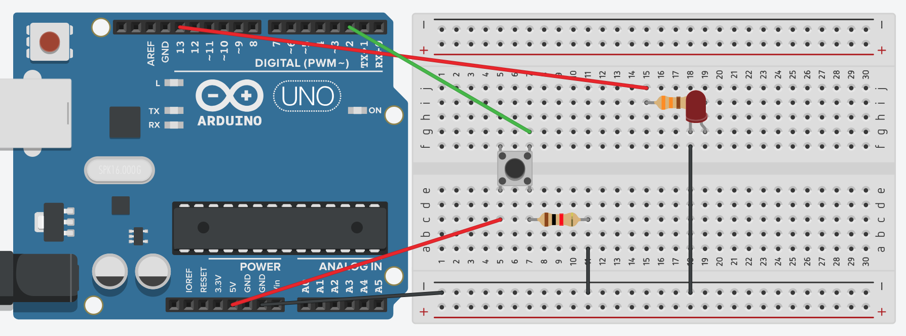

# Debounce version 2.

Demo of how to read a push button to toggle an LED on and off with a much better solution
to the debounce issue of the button.  What makes this better is that it monitors the bouncing and waits for it to stop before giving a result.  It also does not rely on a delay.

